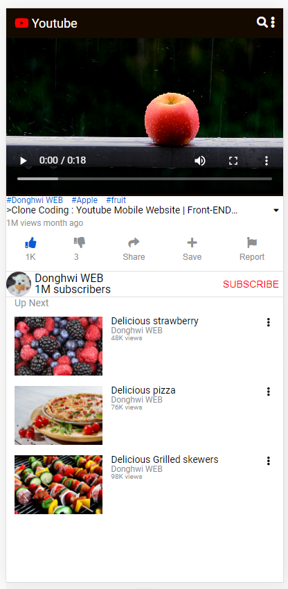
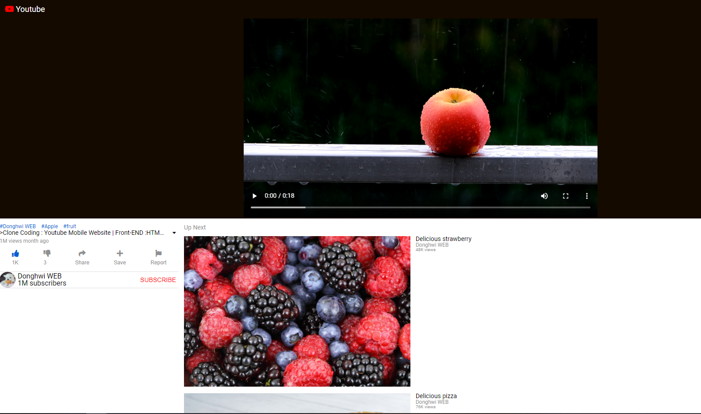

# YouTube_Page_CloneCoding_CSS - (Responsive web)

##<기술스택>
##Html , Css , Javascript

mobile first design으로 가장 작은 화면인 모바일에 초점을 맞추고 그 이후에 화면의 크기가 변하면 변한 크기에 대한 
- Responsive web

### [웹페이지 바로가기](https://wondonghwi.github.io/YouTube_Page_CloneCoding_CSS/)

768px 이하(Tablets + Phones)

768px 이상

